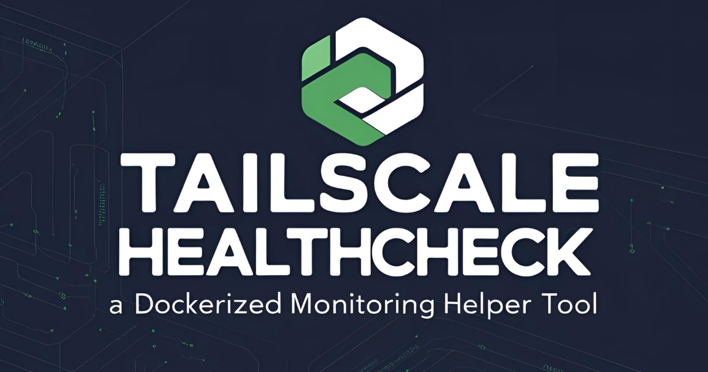

# 🚀 Tailscale Healthcheck – A Dockerized Monitoring Helper Tool

<p align="center">
  
  
  
  
  
  
  
  
  
</p>

<p align="center">
  
</p>

## 📖 Table of Contents
- [✨ Description](#-description)
- [🌟 Features](#-features)
- [📝 Release Notes](#-release-notes)
- [📡 Endpoints](#-endpoints)
  - [`/health`](#health)
  - [`/health/<identifier>`](#healthidentifier)
  - [`/health/healthy`](#healthhealthy)
  - [`/health/unhealthy`](#healthunhealthy)
- [⚙️ Configuration](#️-configuration)
  - [Using OAuth for Authentication](#using-oauth-for-authentication-recommended)
  - [Creating a Tailscale OAuth Client](#creating-a-tailscale-oauth-client)
  - [Generating the Tailscale API Key](#generating-the-tailscale-api-key)
- [🐳 Running with Docker](#-running-with-docker)
  - [Build and Run Locally](#build-and-run-locally)
  - [Run from Docker Hub](#run-from-docker-hub)
- [📡 Integration with Gatus Monitoring System](#-integration-with-gatus-monitoring-system)
- [🔧 Development](#-development)
  - [Linting](#linting)
  - [Testing](#testing)
- [📜 License](#-license)
- [🤝 Contributing](#-contributing)
- [⭐ Star History](#-star-history)

## ✨ Description

A Python-based Flask application to monitor the health of devices in a Tailscale network. The application provides endpoints to check the health status of all devices, specific devices, and lists of healthy or unhealthy devices.

## 🌟 Features

- **Overall Health Status**: Combined health status based on:
  - Device online status (`online_healthy`)
  - Device key expiry status (`key_healthy`)
  - Device update status (`update_healthy`, optional)
- **Global Health Metrics**: 
  - Global device health status (`global_healthy`)
  - Global online status (`global_online_healthy`)
  - Global key health status (`global_key_healthy`)
  - Global update status (`global_update_healthy`)
- **Update Status**:
  - Update availability status
  - Client version tracking
  - Update health filtering with wildcards
  - Include/exclude update filter support by identifier and tags
- **Device Filtering**:
  - OS-based filtering with wildcards
  - Device identifier filtering (hostname, ID, name)
  - Tag-based filtering with wildcards
  - Include/exclude filter support
- **Key expiry**: Days until key expiry (`key_days_to_expire`)
- **Counter Metrics**: Detailed counters for healthy/unhealthy devices
- **Health Status**: Check the health of all devices in the Tailscale network.
- **Device Lookup**: Query the health of a specific device by hostname, ID, or name (case-insensitive).
- **Healthy Devices**: List all healthy devices.
- **Unhealthy Devices**: List all unhealthy devices.
- **Timezone Support**: Adjust `lastSeen` timestamps to a configurable timezone.

## 📝 Release Notes

### 1.2.5
- Added update status capabilities:
  - Update health status with `update_healthy` field
  - Client version tracking with `clientVersion` field
  - Update availability status with `updateAvailable` field
  - New global update health metric `global_update_healthy`
  - Configurable update health threshold with `GLOBAL_UPDATE_HEALTHY_THRESHOLD`
  - Optional inclusion of update health in overall health status via `UPDATE_HEALTHY_IS_INCLUDED_IN_HEALTH`
  - Update health filtering by identifier (INCLUDE_IDENTIFIER_UPDATE_HEALTHY, EXCLUDE_IDENTIFIER_UPDATE_HEALTHY)
  - Update health filtering by tags (INCLUDE_TAG_UPDATE_HEALTHY, EXCLUDE_TAG_UPDATE_HEALTHY)

### 1.2.4
- Added tag filtering capabilities:
  - Tag filters (INCLUDE_TAGS, EXCLUDE_TAGS)
  - Support for wildcard patterns in filter strings
  - Include filters take precedence over exclude filters
  - Multiple tag matching support per device

### 1.2.3
- Added device filtering capabilities:
  - Operating system filters (INCLUDE_OS, EXCLUDE_OS)
  - Device identifier filters (INCLUDE_IDENTIFIER, EXCLUDE_IDENTIFIER)
  - Support for wildcard patterns in filter strings
  - Include filters take precedence over exclude filters

### 1.2.2
- Added `key_days_to_expire` field showing the number of days until a device's key expires
- Set to `null` when key expiry is disabled

### 1.2.1
- Added global health metrics with configurable thresholds
  - GLOBAL_HEALTHY_THRESHOLD (default: 100)
  - GLOBAL_ONLINE_HEALTHY_THRESHOLD (default: 100)
  - GLOBAL_KEY_HEALTHY_THRESHOLD (default: 100)
- Added detailed counter metrics for monitoring device states
  - Healthy/unhealthy device counters
  - Online/offline device counters
  - Valid/expired key counters

### 1.2.0
- Added key expiry monitoring with configurable threshold (KEY_THRESHOLD_MINUTES, default: 1440)
- Introduced combined health status based on online status and key expiry
- Added new health indicators in API response:
  - online_healthy: Device online status
  - key_healthy: Key expiry status
  - healthy: Combined status (true only if both checks pass)
- Added keyExpiryDisabled and keyExpiryTimestamp fields in API response
- Improved timezone handling for all timestamp fields

### 1.1.3
- Added `worker_exit` hook in Gunicorn to log worker exits and confirm restarts.
- Enhanced error handling for `RemoteDisconnected` and `ProtocolError` in `make_authenticated_request` to retry requests instead of crashing workers.
- Improved logging for better debugging of worker lifecycle and connection issues.

### 1.1.2
- Updated GitHub Actions workflow to include validation on publishing of Docker containers

### 1.1.1
- Improved OAuth token renewal logic to handle retries and logging for better reliability.
- Added a global timer to automatically refresh the OAuth token every 50 minutes.
- Enhanced error handling for unknown timezones and invalid API responses.
- Improved logging for debugging, including token renewal times and device health checks.
- Fixed an issue where trailing slashes in URLs caused unnecessary redirects.
- Added logic to immediately refresh the OAuth token upon receiving a 401 Unauthorized error during API requests.
- Introduced a helper function to handle authenticated requests with automatic token refresh.
- Improved error handling and retry logic for token renewal failures.
- Enhanced logging for better debugging and monitoring of token usage and renewal.

### 1.1
- Added support for Tailscale OAuth Client authentication.
- OAuth tokens are automatically renewed every 50 minutes.
- Improved logging to include token renewal times in the configured timezone.

### 1.0
- Initial release of the Tailscale Healthcheck application.
- Supports health checks for all devices, specific devices, healthy devices, and unhealthy devices.
- Includes timezone support for `lastSeen` timestamps.
- Dockerized for easy deployment.

## 📡 Endpoints

### `/health`
Returns the health status of all devices.

**Example Response**:
```json
{
  "devices": [
    {
      "id": "1234567890",
      "device": "examplehostname.example.com",
      "machineName": "examplehostname",
      "hostname": "examplehostname",
      "os": "macOS",
      "clientVersion": "v1.36.0",
      "updateAvailable": false,
      "update_healthy": true,
      "lastSeen": "2025-04-09T22:03:57+02:00",
      "online_healthy": true,
      "keyExpiryDisabled": false,
      "keyExpiryTimestamp": "2025-05-09T22:03:57+02:00",
      "key_healthy": true,
      "key_days_to_expire": 25,
      "healthy": true,
      "tags": ["user-device", "admin-device"]
    }
  ],
  "metrics": {
    "counter_healthy_true": 1,
    "counter_healthy_false": 0,
    "counter_healthy_online_true": 1,
    "counter_healthy_online_false": 0,
    "counter_key_healthy_true": 1,
    "counter_key_healthy_false": 0,
    "counter_update_healthy_true": 1,
    "counter_update_healthy_false": 0,
    "global_key_healthy": true,
    "global_online_healthy": true,
    "global_healthy": true,
    "global_update_healthy": true
  }
}
```

### `/health/<identifier>`
Returns the health status of a specific device by hostname, ID, or name.

### `/health/healthy`
Returns a list of all healthy devices.

### `/health/unhealthy`
Returns a list of all unhealthy devices.

## ⚙️ Configuration

The application is configured using environment variables:

| Variable             | Default Value      | Description                                                                 |
|----------------------|--------------------|-----------------------------------------------------------------------------|
| `TAILNET_DOMAIN`     | `example.com`     | The Tailscale tailnet domain.                                              |
| `AUTH_TOKEN`         | None              | The Tailscale API token (required if OAuth is not configured).             |
| `OAUTH_CLIENT_ID`    | None              | The OAuth client ID (required if using OAuth).                             |
| `OAUTH_CLIENT_SECRET`| None              | The OAuth client secret (required if using OAuth).                         |
| `ONLINE_THRESHOLD_MINUTES`  | `5`               | The threshold in minutes to determine online health.                       |
| `KEY_THRESHOLD_MINUTES`     | `1440`            | The threshold in minutes to determine key expiry health.                  |
| `GLOBAL_HEALTHY_THRESHOLD`  | `100`             | The threshold for total unhealthy.                               |
| `GLOBAL_ONLINE_HEALTHY_THRESHOLD`| `100`        | The threshold for total online health.                                       |
| `GLOBAL_KEY_HEALTHY_THRESHOLD`   | `100`        | The threshold for total key health.                             |
| `GLOBAL_UPDATE_HEALTHY_THRESHOLD`| `100`        | The threshold for total update health.                             |
| `UPDATE_HEALTHY_IS_INCLUDED_IN_HEALTH`| `NO` | Whether update health is included in overall health status. Example: `YES`                             |
| `PORT`               | `5000`            | The port the application runs on.                                          |
| `TIMEZONE`           | `UTC`             | The timezone for `lastSeen` adjustments. Example: `Europe/Berlin`                                  |
| `INCLUDE_OS`         | `""`              | Filter to include only specific operating systems (comma-separated, wildcards allowed) |
| `EXCLUDE_OS`         | `""`              | Filter to exclude specific operating systems (comma-separated, wildcards allowed)      |
| `INCLUDE_IDENTIFIER` | `""`              | Filter to include only specific devices by identifier (comma-separated, wildcards allowed) |
| `EXCLUDE_IDENTIFIER` | `""`              | Filter to exclude specific devices by identifier (comma-separated, wildcards allowed)  |
| `INCLUDE_TAGS`       | `""`              | Filter to include only specific devices by tags (comma-separated, wildcards allowed) |
| `EXCLUDE_TAGS`       | `""`              | Filter to exclude specific devices by tags (comma-separated, wildcards allowed)  |
| `INCLUDE_IDENTIFIER_UPDATE_HEALTHY` | `""`              | Filter to include only specific devices by identifier for update health (comma-separated, wildcards allowed) |
| `EXCLUDE_IDENTIFIER_UPDATE_HEALTHY` | `""`              | Filter to exclude specific devices by identifier for update health (comma-separated, wildcards allowed)  |
| `INCLUDE_TAG_UPDATE_HEALTHY`       | `""`              | Filter to include only specific devices by tags for update health (comma-separated, wildcards allowed) |
| `EXCLUDE_TAG_UPDATE_HEALTHY`       | `""`              | Filter to exclude specific devices by tags for update health (comma-separated, wildcards allowed)  |

### Response Metrics

The API response includes the following health metrics:

**Counter Metrics:**
- `counter_healthy_true/false`: Number of healthy/unhealthy devices
- `counter_healthy_online_true/false`: Number of online/offline devices
- `counter_key_healthy_true/false`: Number of devices with valid/expired keys

**Global Health Metrics:**
- `global_key_healthy`: True if key_healthy_false count is below threshold
- `global_online_healthy`: True if healthy_online_false count is below threshold
- `global_healthy`: True if healthy_false count is below threshold
- `global_update_healthy`: True if update_healthy_false count is below threshold

These global metrics become false when their respective false counters exceed the GLOBAL_UNHEALTHY_THRESHOLD.

### Using OAuth for Authentication (!RECOMMENDED!)

If you prefer to use OAuth instead of an API token (`AUTH_TOKEN`), configure the following environment variables:

1. **`OAUTH_CLIENT_ID`**: The client ID for your OAuth application.
2. **`OAUTH_CLIENT_SECRET`**: The client secret for your OAuth application.

When OAuth is configured, the application will automatically fetch an access token from the Tailscale API and use it for authentication. The access token is renewed every 50 minutes to ensure uninterrupted operation. Additionally, the application will immediately refresh the OAuth token upon receiving a 401 Unauthorized error during API requests.

**Note**: If both `AUTH_TOKEN` and OAuth credentials are configured, OAuth will take priority.

**Recommendation**: It is highly recommended to use OAuth for authentication instead of an API token (`AUTH_TOKEN`) for better security and token management.

### Creating a Tailscale OAuth Client

To use OAuth, you need to create a Tailscale OAuth client with the required permissions:

1. Visit the Tailscale Admin Console:  
   [https://login.tailscale.com/admin/settings/oauth](https://login.tailscale.com/admin/settings/oauth)

2. Click **Create OAuth Client** and configure the following:
   - **Name**: Provide a descriptive name for the client (e.g., `Tailscale Healthcheck`).
   - **Permissions**: Grant `read` permissions on `devices:core`.

3. Copy the generated **Client ID** and **Client Secret**.

4. Set the `OAUTH_CLIENT_ID` and `OAUTH_CLIENT_SECRET` environment variables in your `.env` file or Docker configuration.

**Note**: Ensure the OAuth client credentials are stored securely and not shared publicly.

### Generating the Tailscale API Key

To use this application with an API token, you need to generate a Tailscale API key:

1. Visit the Tailscale Admin Console:  
   [https://login.tailscale.com/admin/settings/keys](https://login.tailscale.com/admin/settings/keys)

2. Click **Generate Key** and copy the generated API key.

3. Set the API key as the `AUTH_TOKEN` environment variable.

**Note**: Ensure the API key is stored securely and not shared publicly.

### Filter Configuration Examples

The application supports filtering devices by OS, identifier (hostname, ID, or name), and tags using wildcards:

**Operating System Filters:**
```bash
# Include only Windows and macOS devices
INCLUDE_OS="linux*,freebsd*"

# Exclude Linux devices
EXCLUDE_OS="iOS*"
```

**Device Identifier Filters:**
```bash
# Include only devices with specific names
INCLUDE_IDENTIFIER="firewall*,server*"

# Exclude specific devices
EXCLUDE_IDENTIFIER="test*,dev*,iphone*,ipad*"
```

**Tag Filters:**
```bash
# Include only devices with specific tags
INCLUDE_TAGS="admin*,infra*"

# Exclude specific devices by tags
EXCLUDE_TAGS="test*,dev*"
```

**Update Health Filters:**
```bash
# Include only devices with specific identifiers for update health
INCLUDE_IDENTIFIER_UPDATE_HEALTHY="firewall*,server*"

# Exclude specific devices by identifiers for update health
EXCLUDE_IDENTIFIER_UPDATE_HEALTHY="test*,dev*,iphone*,ipad*"

# Include only devices with specific tags for update health
INCLUDE_TAG_UPDATE_HEALTHY="admin*,infra*"

# Exclude specific devices by tags for update health
EXCLUDE_TAG_UPDATE_HEALTHY="test*,dev*"
```

**Note**: When `INCLUDE` filters are set, `EXCLUDE` filters are ignored for that category. Empty filter values mean no filtering is applied.

## 🐳 Running with Docker

### Build and Run Locally

### 1. **Build the Docker Image**:
   ```bash
   docker build -t laitco/tailscale-healthcheck .
   ```

### 2. **Run the Docker Container**:

#### Using an API Key
```bash
docker run -d -p 5000:5000 \
    -e TAILNET_DOMAIN="example.com" \
    -e AUTH_TOKEN="your-api-key" \
    -e ONLINE_THRESHOLD_MINUTES=5 \
    -e KEY_THRESHOLD_MINUTES=1440 \
    -e GLOBAL_HEALTHY_THRESHOLD=100 \
    -e GLOBAL_ONLINE_HEALTHY_THRESHOLD=100 \
    -e GLOBAL_KEY_HEALTHY_THRESHOLD=100 \
    -e GLOBAL_UPDATE_HEALTHY_THRESHOLD=100 \
    -e UPDATE_HEALTHY_IS_INCLUDED_IN_HEALTH=NO \
    -e PORT=5000 \
    -e TIMEZONE="Europe/Berlin" \
    -e INCLUDE_OS="" \
    -e EXCLUDE_OS="" \
    -e INCLUDE_IDENTIFIER="" \
    -e EXCLUDE_IDENTIFIER="" \
    -e INCLUDE_TAGS="" \
    -e EXCLUDE_TAGS="" \
    -e INCLUDE_IDENTIFIER_UPDATE_HEALTHY="" \
    -e EXCLUDE_IDENTIFIER_UPDATE_HEALTHY="" \
    -e INCLUDE_TAG_UPDATE_HEALTHY="" \
    -e EXCLUDE_TAG_UPDATE_HEALTHY="" \
    --name tailscale-healthcheck laitco/tailscale-healthcheck
```

#### Using OAuth
```bash
docker run -d -p 5000:5000 \
    -e TAILNET_DOMAIN="example.com" \
    -e OAUTH_CLIENT_ID="your-oauth-client-id" \
    -e OAUTH_CLIENT_SECRET="your-oauth-client-secret" \
    -e ONLINE_THRESHOLD_MINUTES=5 \
    -e KEY_THRESHOLD_MINUTES=1440 \
    -e GLOBAL_HEALTHY_THRESHOLD=100 \
    -e GLOBAL_ONLINE_HEALTHY_THRESHOLD=100 \
    -e GLOBAL_KEY_HEALTHY_THRESHOLD=100 \
    -e GLOBAL_UPDATE_HEALTHY_THRESHOLD=100 \
    -e UPDATE_HEALTHY_IS_INCLUDED_IN_HEALTH=NO \
    -e PORT=5000 \
    -e TIMEZONE="Europe/Berlin" \
    -e INCLUDE_OS="" \
    -e EXCLUDE_OS="" \
    -e INCLUDE_IDENTIFIER="" \
    -e EXCLUDE_IDENTIFIER="" \
    -e INCLUDE_TAGS="" \
    -e EXCLUDE_TAGS="" \
    -e INCLUDE_IDENTIFIER_UPDATE_HEALTHY="" \
    -e EXCLUDE_IDENTIFIER_UPDATE_HEALTHY="" \
    -e INCLUDE_TAG_UPDATE_HEALTHY="" \
    -e EXCLUDE_TAG_UPDATE_HEALTHY="" \
    --name tailscale-healthcheck laitco/tailscale-healthcheck
```

### 3. **Access the Application**:
   Open your browser and navigate to:
   ```
   http://IP-ADDRESS_OR_HOSTNAME:5000/health
   ```

### Run from Docker Hub

### 1. **Pull the Docker Image**:
   ```bash
   docker pull laitco/tailscale-healthcheck:latest
   ```

### 2. **Run the Docker Container**:

#### Using an API Key
```bash
docker run -d -p 5000:5000 \
    -e TAILNET_DOMAIN="example.com" \
    -e AUTH_TOKEN="your-api-key" \
    -e ONLINE_THRESHOLD_MINUTES=5 \
    -e KEY_THRESHOLD_MINUTES=1440 \
    -e GLOBAL_HEALTHY_THRESHOLD=100 \
    -e GLOBAL_ONLINE_HEALTHY_THRESHOLD=100 \
    -e GLOBAL_KEY_HEALTHY_THRESHOLD=100 \
    -e GLOBAL_UPDATE_HEALTHY_THRESHOLD=100 \
    -e UPDATE_HEALTHY_IS_INCLUDED_IN_HEALTH=NO \
    -e PORT=5000 \
    -e TIMEZONE="Europe/Berlin" \
    -e INCLUDE_OS="" \
    -e EXCLUDE_OS="" \
    -e INCLUDE_IDENTIFIER="" \
    -e EXCLUDE_IDENTIFIER="" \
    -e INCLUDE_TAGS="" \
    -e EXCLUDE_TAGS="" \
    -e INCLUDE_IDENTIFIER_UPDATE_HEALTHY="" \
    -e EXCLUDE_IDENTIFIER_UPDATE_HEALTHY="" \
    -e INCLUDE_TAG_UPDATE_HEALTHY="" \
    -e EXCLUDE_TAG_UPDATE_HEALTHY="" \
    --name tailscale-healthcheck laitco/tailscale-healthcheck:latest
```

#### Using OAuth
```bash
docker run -d -p 5000:5000 \
    -e TAILNET_DOMAIN="example.com" \
    -e OAUTH_CLIENT_ID="your-oauth-client-id" \
    -e OAUTH_CLIENT_SECRET="your-oauth-client-secret" \
    -e ONLINE_THRESHOLD_MINUTES=5 \
    -e KEY_THRESHOLD_MINUTES=1440 \
    -e GLOBAL_HEALTHY_THRESHOLD=100 \
    -e GLOBAL_ONLINE_HEALTHY_THRESHOLD=100 \
    -e GLOBAL_KEY_HEALTHY_THRESHOLD=100 \
    -e GLOBAL_UPDATE_HEALTHY_THRESHOLD=100 \
    -e UPDATE_HEALTHY_IS_INCLUDED_IN_HEALTH=NO \
    -e PORT=5000 \
    -e TIMEZONE="Europe/Berlin" \
    -e INCLUDE_OS="" \
    -e EXCLUDE_OS="" \
    -e INCLUDE_IDENTIFIER="" \
    -e EXCLUDE_IDENTIFIER="" \
    -e INCLUDE_TAGS="" \
    -e EXCLUDE_TAGS="" \
    -e INCLUDE_IDENTIFIER_UPDATE_HEALTHY="" \
    -e EXCLUDE_IDENTIFIER_UPDATE_HEALTHY="" \
    -e INCLUDE_TAG_UPDATE_HEALTHY="" \
    -e EXCLUDE_TAG_UPDATE_HEALTHY="" \
    --name tailscale-healthcheck laitco/tailscale-healthcheck:latest
```

### 3. **Access the Application**:
   Open your browser and navigate to:
   ```
   http://IP-ADDRESS_OR_HOSTNAME:5000/health
   ```

## 📡 Integration with Gatus Monitoring System

You can integrate this healthcheck application with the [Gatus](https://github.com/TwiN/gatus) monitoring system to monitor the health of specific devices.

### Example Configuration

```yaml
endpoints:
  - name: tailscale-examplehostname.example.com
    group: tailscale
    url: "http://IP-ADDRESS_OR_HOSTNAME:5000/health/examplehostname"
    interval: 5m
    conditions:
      - "[STATUS] == 200"
      - "[BODY].device.healthy == pat(*true*)"
    alerts:
      - type: email
        failure-threshold: 2
        success-threshold: 3
        description: "healthcheck failed"
        send-on-resolved: true
```

### Explanation

- **`name`**: A descriptive name for the endpoint being monitored.
- **`group`**: A logical grouping for endpoints (e.g., `tailscale`).
- **`url`**: The URL of the healthcheck endpoint for a specific device.
- **`interval`**: The frequency of the healthcheck (e.g., every 5 minutes).
- **`conditions`**:
  - `[STATUS] == 200`: Ensures the HTTP status code is `200`.
  - `[BODY].device.healthy == pat(*true*)`: Checks if the `healthy` field in the response body is `true`.
- **`alerts`**:
  - **`type`**: The type of alert (e.g., `email`).
  - **`failure-threshold`**: The number of consecutive failures before triggering an alert.
  - **`success-threshold`**: The number of consecutive successes before resolving an alert.
  - **`description`**: A description of the alert.
  - **`send-on-resolved`**: Whether to send a notification when the issue is resolved.

For more details on configuring Gatus, refer to the [Gatus documentation](https://github.com/TwiN/gatus).

## 🔧 Development

### Linting
Run `flake8` to lint the code:
```bash
pip install flake8
flake8 healthcheck.py
```

### Testing
Use `pytest` for testing:
```bash
pip install pytest
pytest
```

## 📜 License

This project is licensed under the MIT License. See the [LICENSE](LICENSE) file for details.

## 🤝 Contributing

Contributions are welcome! Please open an issue or submit a pull request.

## ⭐ Star History

[](https://www.star-history.com/#laitco/tailscale-healthcheck&Date)